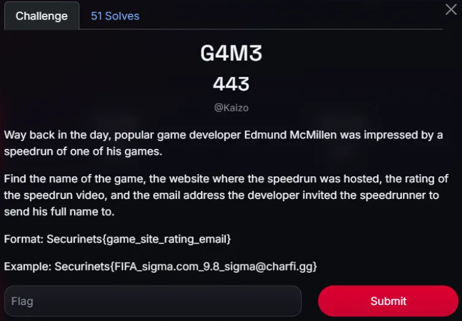
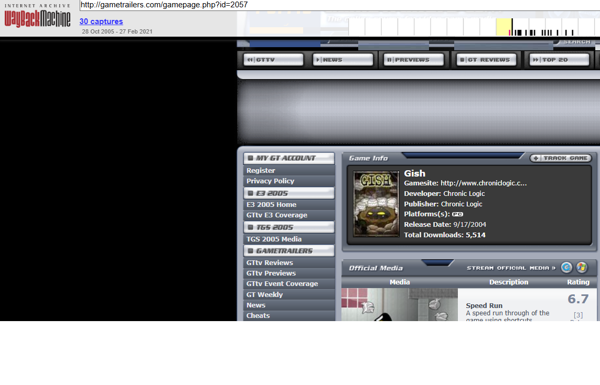

# Securinets CTF 2025 OSINT

So, I quickly want to know, who Edmund is and I acquire that he is a game developer since 2000 era. 

So I asked chatgpt, what are famous website for game developer & speedrunner in the year 2000 , I go to each website and search his name.

I found his acc

Then, I try to search “speed”  in post section of his account

I found few related post.

I believe the link mention is the website of the speedrun.

[http://gametrailers.com/gamepage.php?id=2057](http://gametrailers.com/gamepage.php?id=2057)

So, I try to open the link.

But, when I try to open the link, the page is invalid, so I try wayback

