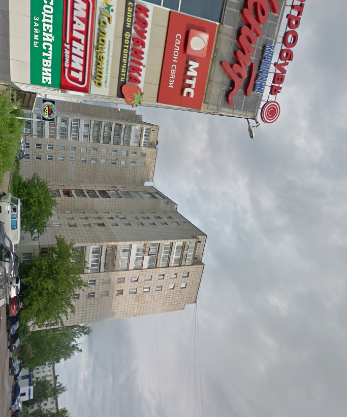
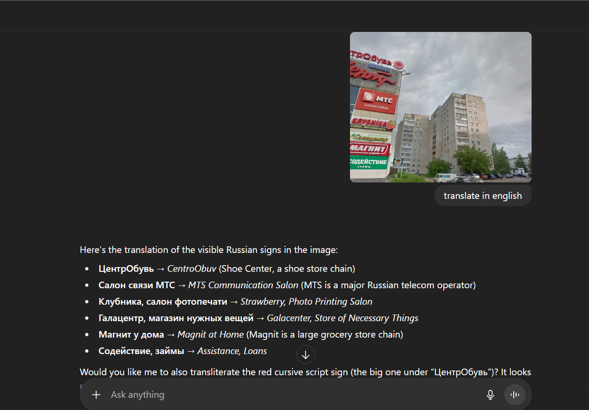
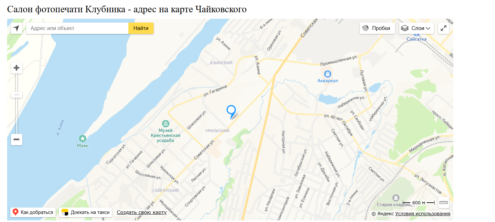
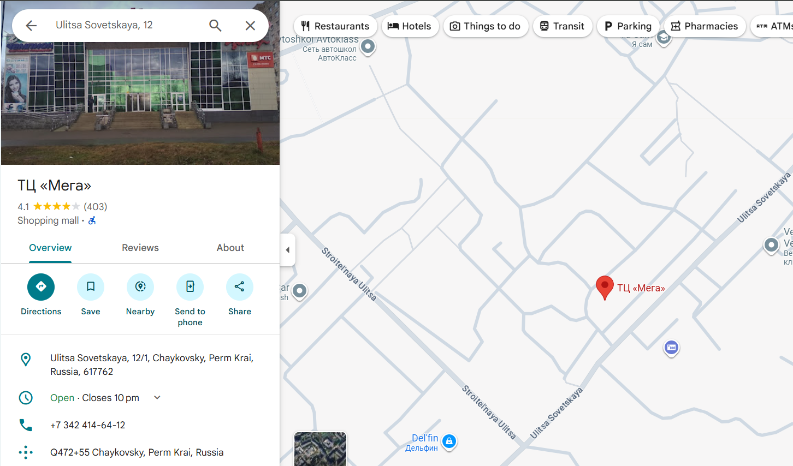

# The Starting Point

By Rizzykun

Category: OSINT

Description: 

One of our agents managed to locate one of the suspects. We lost contact before he could tell us where he was. This snapshot was the only documentation he could send. Can you find where this place is?

Note: Use the google map name if you have found the location.

Flag format: SIBER25{main_street-town_name-state_name-country}

Answer:

Resource:

So, this is the last place the suspect was seen, okay , Let’s lock in!!

First, we need to identify where is this place, maybe the shops could help?

So, he is near these shops. Let’s try locating every single store.

When googling each of the store names, almost every single one returns that it is a part of multiple branches of a store chain in Russia except for Клубника, салон фотопечати (Strawberry, Photo Printing Salon). This store is an independent and unique store, then, I find a city website named chaykovsky which holds info about the store.

 

The website pinpoint the exact location of the store and give the address. Then, I enter the address in google Maps and it gave the result:

Then, we get the address , following the flag format we got : 

SIBER25{ulitsa_sovetskaya-chaykovsky-perm_krai-russia}

The suspect was last seen located near mall named ТЦ (Мега).
