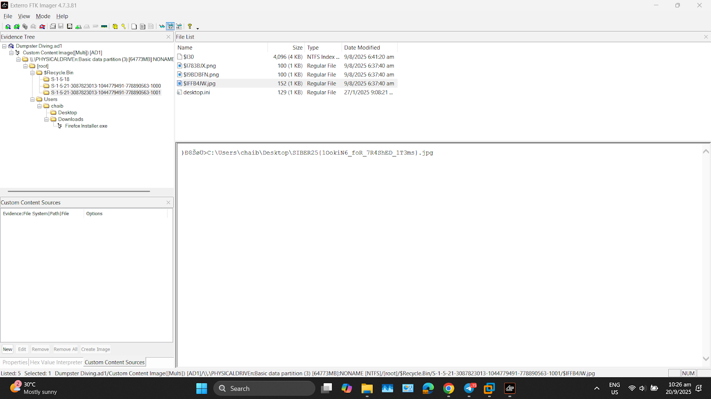
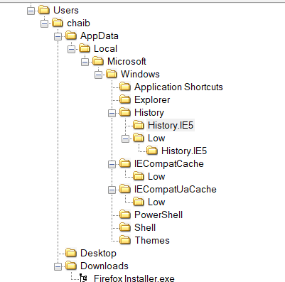
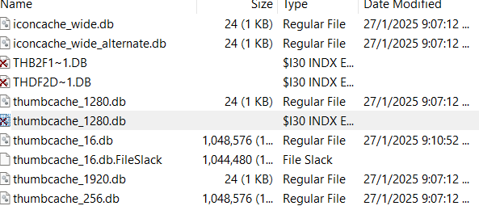
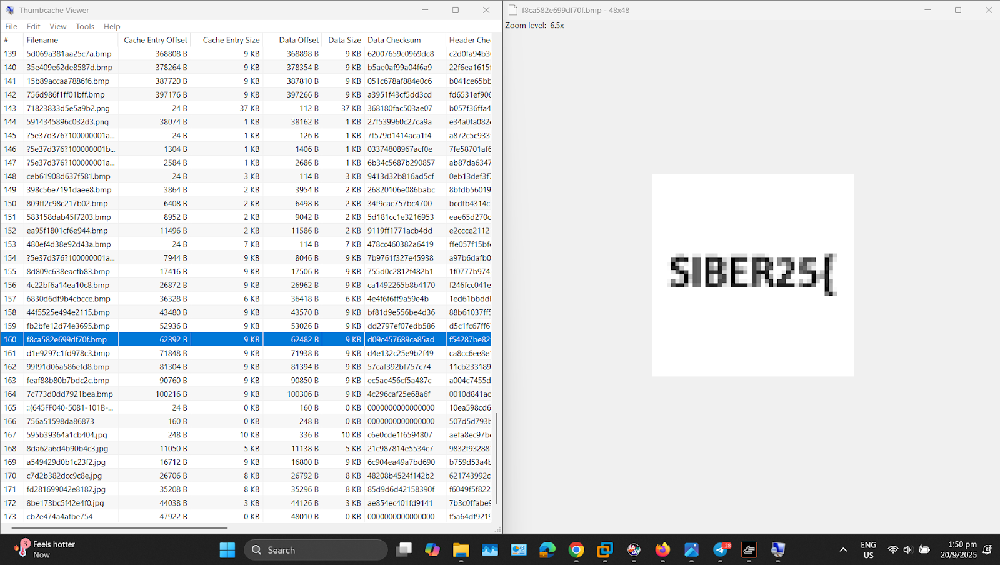

# Challenge 5 : Dumpster Diving

Solved by: Rizzykun

Description:

Aiya. I accidentally deleted the flag when cleaning up my Desktop.

Flag Format: SIBER25{flag} Zip Password: 0b20ca0c4860364140f51583e32bb28cdeecf13ebad62fd66b4f9786bf2c700d Challenge Creator: @identities

Answer : 

Given an image file and .txt file. I immediately opened the image file using Exterro FTK Imager.

As I was traversing through the image file, I found multiple image files in the recycle bin. When I click it to read as ASCII, I get the flag : 

Flag = SIBER25{1OokiN6_foR_7R4ShED_1T3ms}

# Challenge 6 : Viewport

Solved by: Rizzykun

Description:

Oops. I accidentally deleted the flag when cleaning up my Desktop.

Flag Format: SIBER25{flag} Zip Password: e0ff450ab4c79a7810ad46b45f4b8f10678a63df866757566d17b8b998be4161 Challenge Creator: @identities

Answer : 

Just like the Dumpster challenge, I quickly open the image file given using  Exterro FTK Imager. 

I found out there were multiple interesting file directories, and when for looking.

In the explorer folder, I noticed there are multiple deleted files. So I try to export them to my laptop and try to see it using tools named Thumb cache viewer.

I check every single file and I see the flag in an image. Then I merged all the info from all the images and got the flag.

Flag = SIBER25{V3RY_sMA1L_thUm8n411S}
