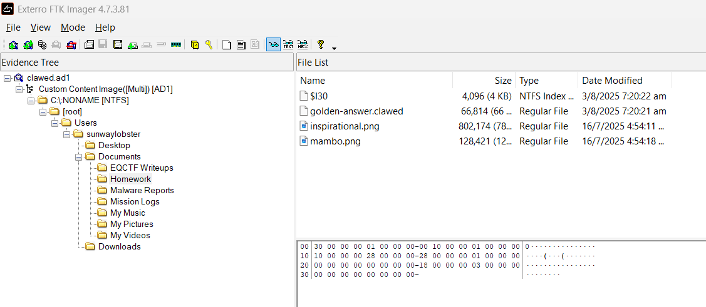
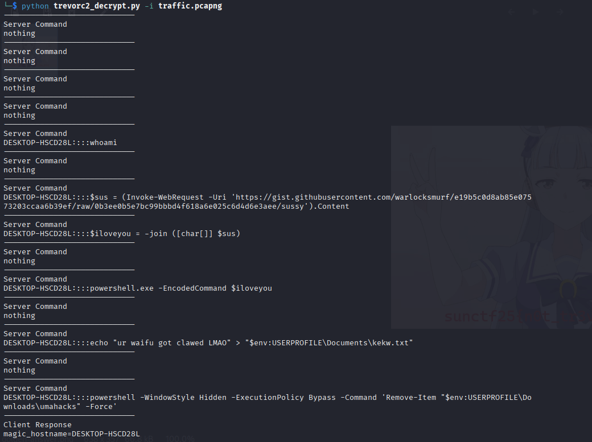
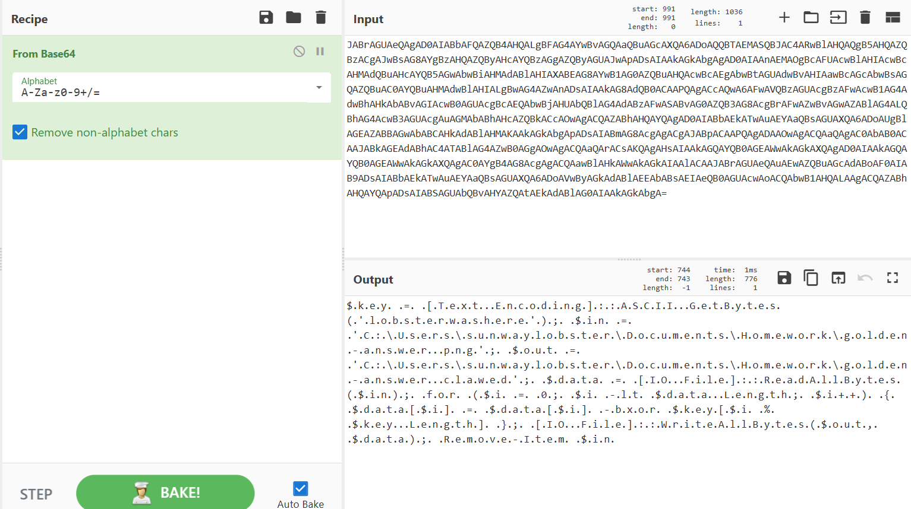

# SUN CTF 2025 Forensic

Challenge : Get Clawed

Analyze a disk image and network traffic capture to uncover hidden data.

Open .pcap file find : 

Suspicious HTTP GET traffic containing ?guid= stood out — indicative of possible C2-style communication.

REFERENCE : 

[https://qiaonpc.github.io/post/get-clawed/](https://qiaonpc.github.io/post/get-clawed/)

[https://warlocksmurf.github.io/posts/cyberspacectf2024/](https://warlocksmurf.github.io/posts/cyberspacectf2024/)

Open disk, find sus: 

Use c2 script get link : 

[https://gist.githubusercontent.com/warlocksmurf/e19b5c0d8ab85e07573203ccaa6b39ef/raw/0b3ee0b5e7bc99bbbd4f618a6e025c6d4d6e3aee/sussy](https://gist.githubusercontent.com/warlocksmurf/e19b5c0d8ab85e07573203ccaa6b39ef/raw/0b3ee0b5e7bc99bbbd4f618a6e025c6d4d6e3aee/sussy)

Base64 it and get what to do with .clawed :

We get the key, decrypt XOR, me can export png now :

Man see flag, man happy
