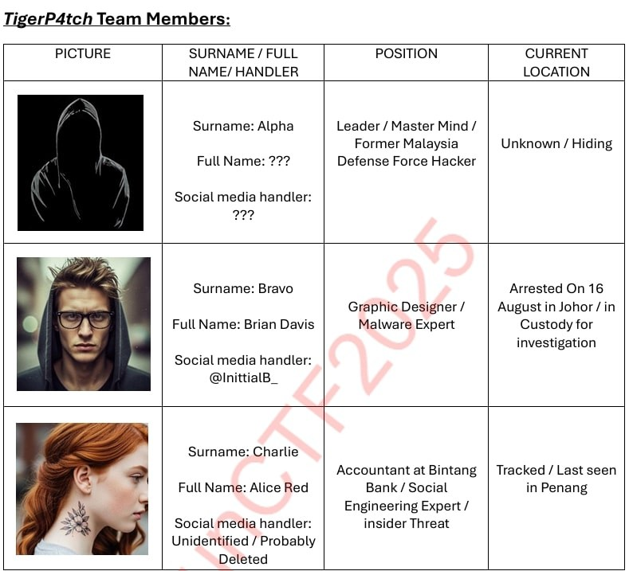
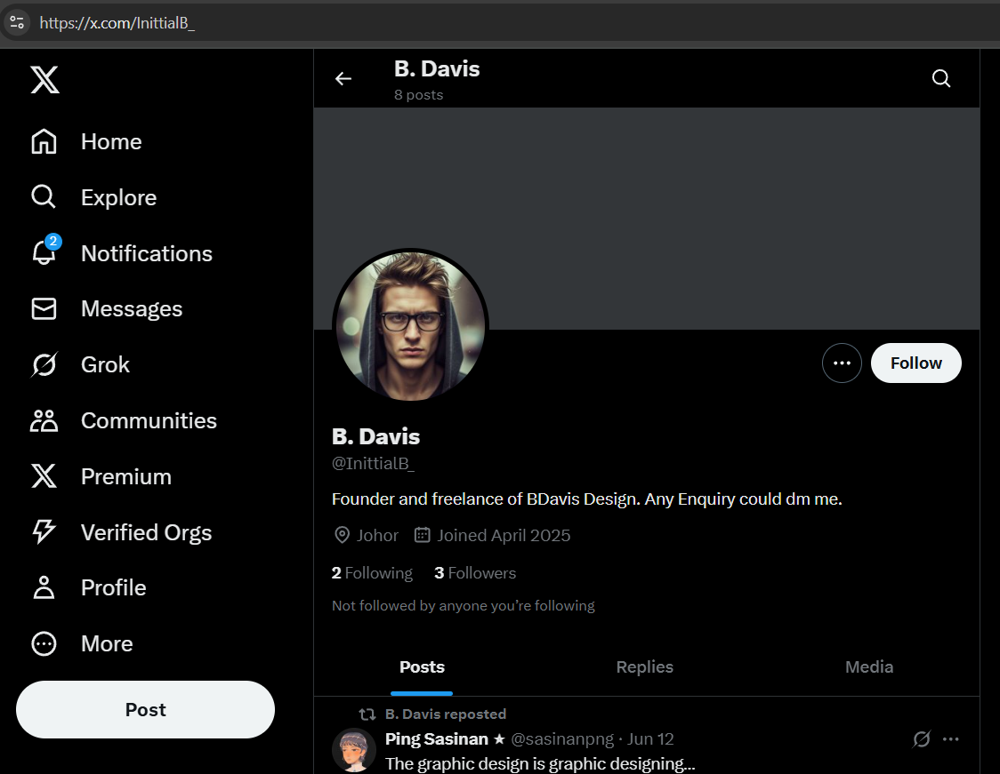
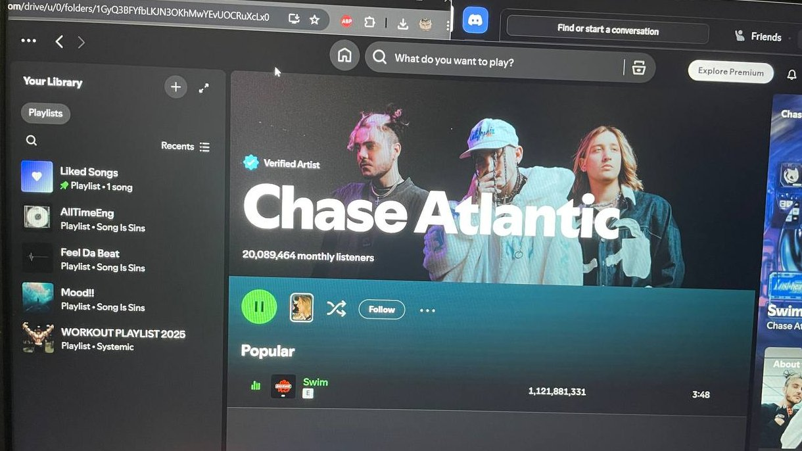
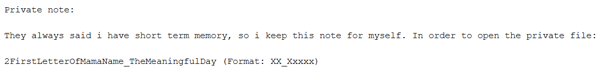
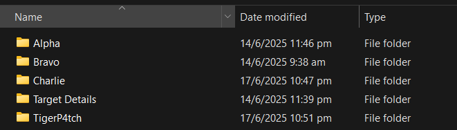
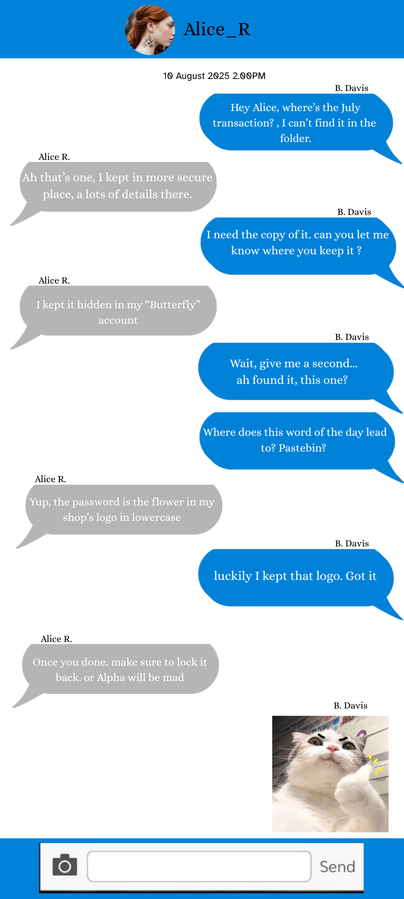
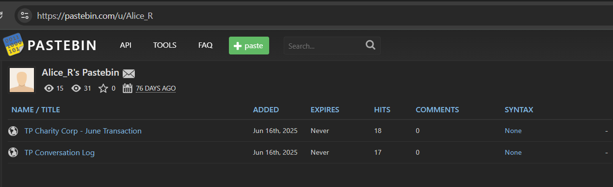
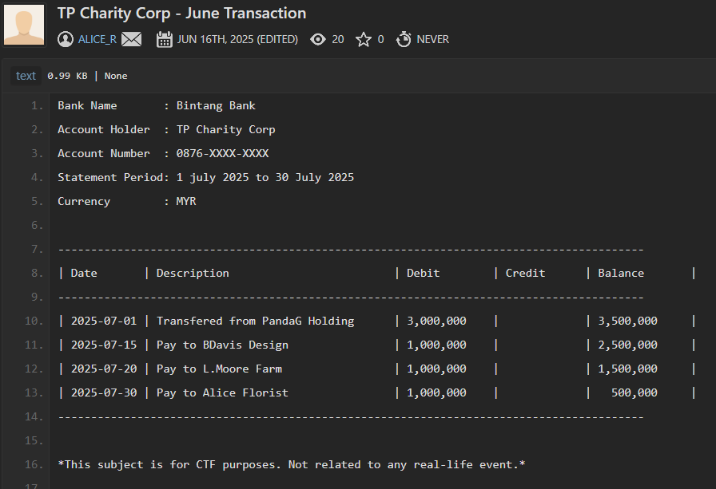

Chall details
|Field|Details|
|---|---|
|**Author**|warlocksmurf & Sai|
|**Category**|OSINT|
|**Score**|260|
|**Description**|One of the largest financial institutions in Malaysia, **MoneyPro Sdn Bhd**, has been breached by a notorious hacker group led by a mysterious figure known only as “Alpha.” As part of the **Malaysia Cyber Defend Associate (MCDA)** team, your mission is to uncover Alpha’s true identity. Flag format: `sunctf25{Firstname_LastName}`|

---

Interestingly this chall only had 4 out of 81 teams that were able to solve it in time.

The challenge shipped with an incident report on the MoneyPro breach: [Investigation Report (PDF)](investigation-report.pdf).

# 🕵️‍♂️ Solution
From the [Investigation Report](https://github.com/Rizzykun/rizzykun.github.io/blob/master/content/post/2025/sunctf/osint/InvesigationReport.pdf) given,
The only lead we have is the social media account of a user named **Bravo**. That’s where the OSINT trail begins..

---

## Tracking Bravo’s Social Media

I searched through popular social platforms and eventually located Bravo’s **X (Twitter)** account.

Scrolling through his timeline revealed an interesting clue—a suspicious **Google Drive link**:

---

## Exploring the Google Drive

The Drive contained:

1. A folder full of **logos**
2. A file named `Private.zip`
3. A `Note.txt` file

Opening the note revealed a **password hint**: it was a combination of Bravo’s mother’s name and an important day (the day he signed a **RM10,000 contract**). Both details can be found in his X posts.

---

## Unlocking the Zip

With the password reconstructed, I unzipped `Private.zip` to find intelligence on the **TigerP4tch** group. Inside Bravo’s folder, I finally uncovered a partial name:

> **Lucas M.**

The hunt for his last name was on.

---

## Following Charlie’s Trail

Inside Charlie’s folder, a chat log between Bravo and Charlie revealed another breadcrumb. Bravo hinted that something important was stored on **Pastebin**.

---

## Pastebin Recon

After some digging, I located a Pastebin account under the username `Alice_R`. However, the paste was **password-protected**.

Back in the Google Drive folder full of logos, I noticed Alice’s shop logo featuring a **rose**. The chat log mentioned the password is the flower on her shop logo. Trying **rose** as the password worked, unlocking the paste.

---

## The Final Reveal

The unlocked paste finally exposed Alpha’s full name:

> **Lucas Moore**

With that, Alpha’s identity was confirmed.
