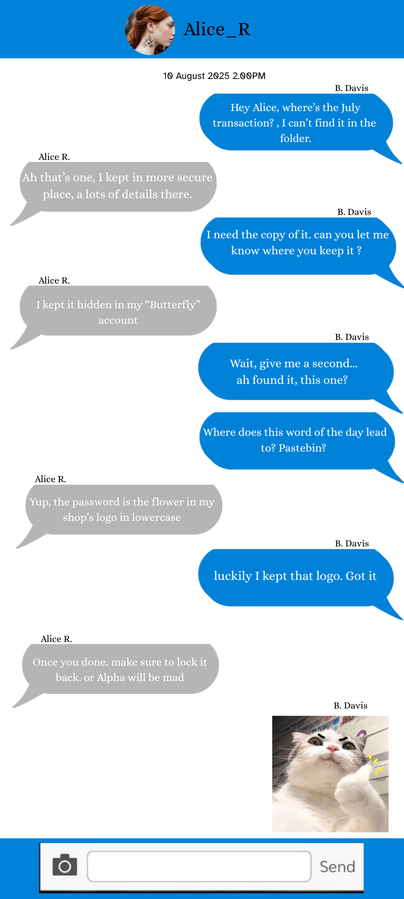

Chall details  
|Field|Details|  
|---|---|  
|**Author**|warlocksmurf & Sai|  
|**Category**|OSINT|  
|**Score**|260|  
|**Description**|One of the largest financial institutions in Malaysia, **MoneyPro Sdn Bhd**, has been breached by a notorious hacker group led by a mysterious figure known only as “Alpha.” As part of the **Malaysia Cyber Defend Associate (MCDA)** team, your mission is to uncover Alpha’s true identity. Flag format: `sunctf25{Firstname_LastName}`|  

---

### 🕵️‍♂️ Investigation
From the investigation report,  
We’re told that the only lead we have is the social media account of a user named **Bravo**. That’s where the OSINT trail begins..

---

#### Step 1: Tracking Bravo’s Social Media

I searched through popular social platforms and eventually located Bravo’s **X (Twitter)** account.  

  

Scrolling through his timeline revealed an interesting clue—a suspicious **Google Drive link**:  

  

---

#### Step 2: Exploring the Google Drive

The Drive contained:

1. A folder full of **logos**  
2. A file named `Private.zip`  
3. A `Note.txt` file  

  

Opening the note revealed a **password hint**: it was a combination of Bravo’s mother’s name and an important day (the day he signed a **RM10,000 contract**). Both details can be found in his X posts.  

  

---

#### Step 3: Unlocking the Zip

With the password reconstructed, I unzipped `Private.zip` to find intelligence on the **TigerP4tch** group. Inside Bravo’s folder, I finally uncovered a partial name:

> **Lucas M.**

The hunt for his last name was on.

---

#### Step 4: Following Charlie’s Trail

Inside Charlie’s folder, a chat log between Bravo and Charlie revealed another breadcrumb. Bravo hinted that something important was stored on **Pastebin**.  

  

---

#### Step 5: Pastebin Recon

After some digging, I located a Pastebin account under the username `Alice_R`. However, the paste was **password-protected**.  

  

Back in the Google Drive folder full of logos, I noticed Alice’s shop logo prominently featuring a **rose**. The chat log mentioned the password is the flower on her shop logo. Trying **rose** as the password worked, unlocking the paste.  

  

---

#### Step 6: The Final Reveal

The unlocked paste finally exposed Bravo’s full name:

> **Lucas Moore**

With that, Alpha’s identity was confirmed.
