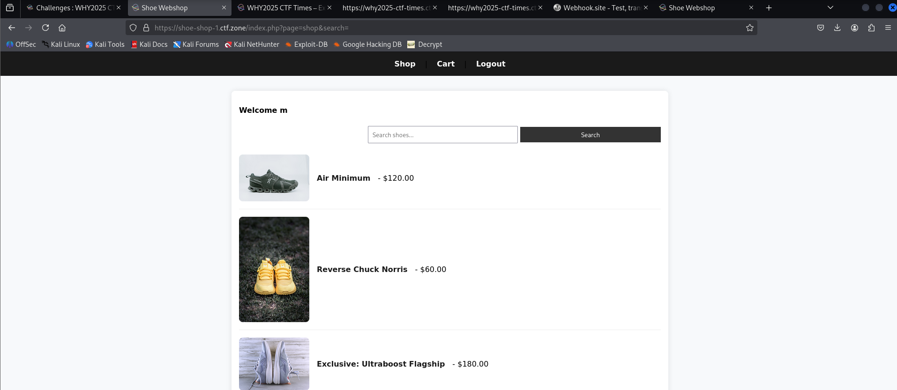

## 📝 Description

We just launched a brand-new [shoe store](https://shoe-shop-1.ctf.zone/) to sell some fancy kicks.  
Unfortunately, the admin beat us to it and already snagged the **exclusive pair** in his cart. 👟✨  
But hey—feel free to explore the shop, try out the cart, and see what you can uncover.

* * *

## 💡 Solution Walkthrough

We’re dealing with an online shoe store where you can:

-   Sign up for an account
    
-   Add items to your cart
    
-   View your cart contents
    

Pretty normal e-commerce flow, right? Or… is it? 👀

* * *

### 🔓 The IDOR Moment

While browsing the cart, something caught my eye…  
The URL looked like this:

`page=cart&id=694`

That `id` parameter smells suspicious. What if we tweak it? 🤔

So let’s try checking **id #1 cart**:

`https://shoe-shop-1.ctf.zone/index.php?page=cart&id=1`

Bingo! 🎯 We just accessed another user’s cart. And guess who that is? Yep—the admin.

* * *

### 🏁 Flag

And there it is:
`flag{00f34f9c417fcaa72b16f79d02d33099}`

* * *

⚡Lesson learned: **Always validate user access before showing sensitive data.**🚨
