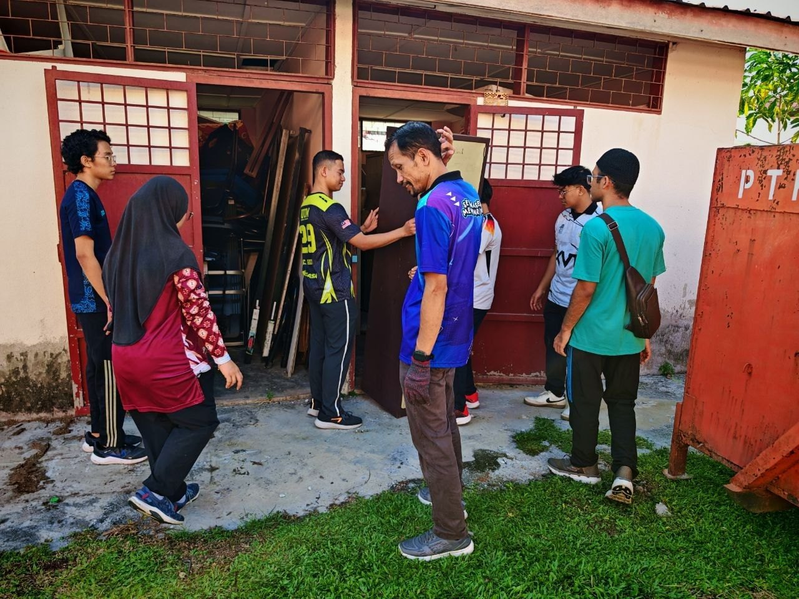
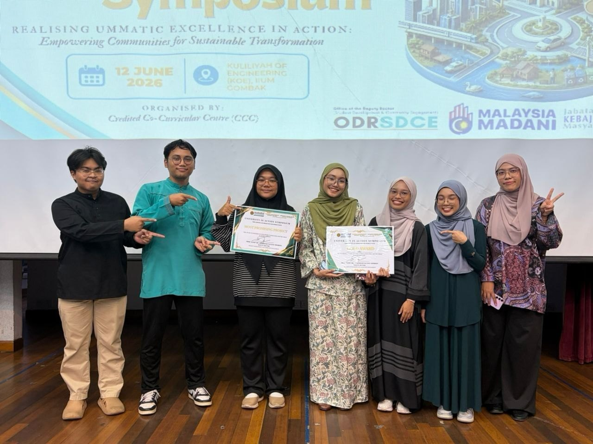
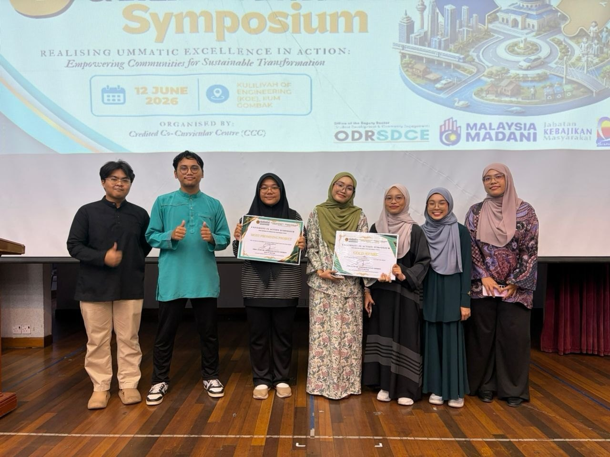

An eight-month project through **Usrah in Action**, a subject run by the
Sejahtera Centre of IIUM, where I served as **Project Manager**.

## The problem

Our team proposed a STEM laboratory design for a school serving visually
impaired students. The question we kept coming back to: how do you make STEM
subjects engaging for students who need a fundamentally different learning
environment?

## The sensory wall

The centrepiece of the proposed lab is a **sensory wall** — students explore
mechanical, electronic and STEM tools through touch, audio guidance and
Braille, rather than through a screen or a whiteboard.

## Community service, and why it mattered

We also ran community service activities at the school. Spending time with the
students and teachers changed how we understood the space we were designing
for. It's the part I'd point to first: the best solutions came from
understanding the people who would actually use them, not from what we assumed
they needed.

Managing it taught me a different set of skills than I'm used to — coordinating
a diverse team, handling things that went sideways, and keeping everyone moving
toward the same goal.

## Outcome

**Gold Award** at the project symposium.

