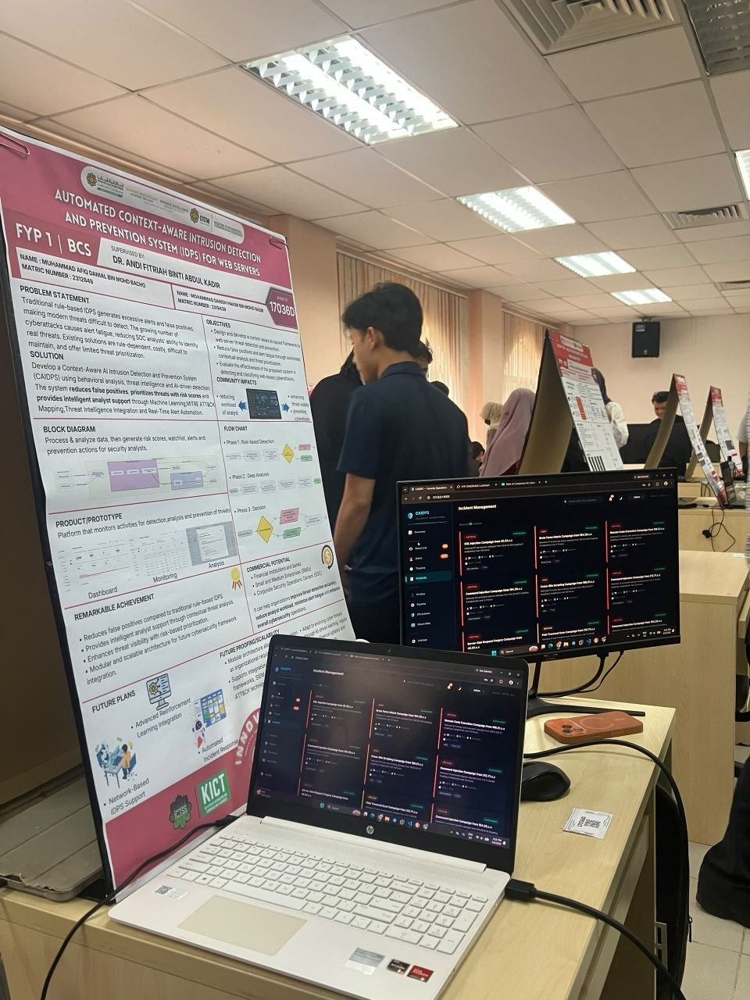
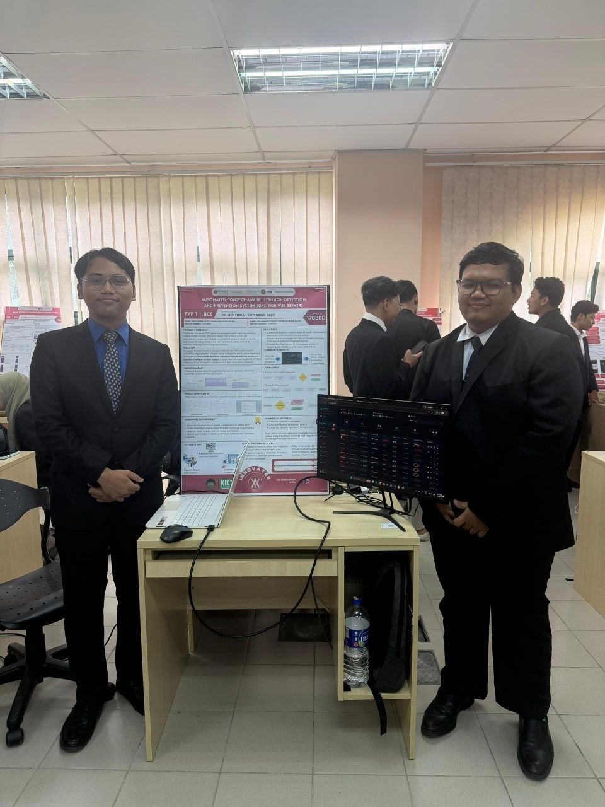

**Automated Context-Aware Intrusion Detection and Prevention System (IDPS) for
Web Servers** — my Final Year Project, built with Mohammad Danish Hakim bin
Mohd Nasir.

## The idea

Most detection systems decide whether a request is malicious by looking at the
request. This project adds **context** — what else is happening around that
request — so prevention decisions are based on more than a signature match in
isolation.

## What FYP 1 covered

The first phase was mostly research: a literature review of how current
industry detection and prevention systems actually work, and a study of
real-world attack patterns against web servers.

Danish and I picked this deliberately to stretch ourselves. We had both done
CTFs and built things before, but reading how production IDS/IPS deployments
handle detection, tuning and false positives made it clear how much of this
field we had only seen from the attacker's side.

## Outcome

**Silver Award** at the FYP 1 project evaluation, 3–4 June 2026.

FYP 2 continues the build.

