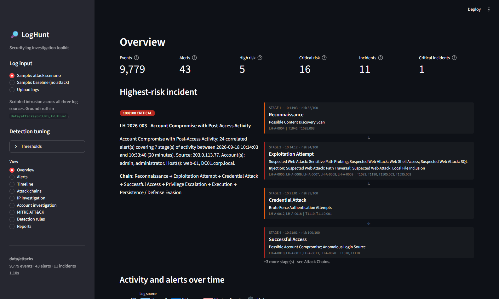
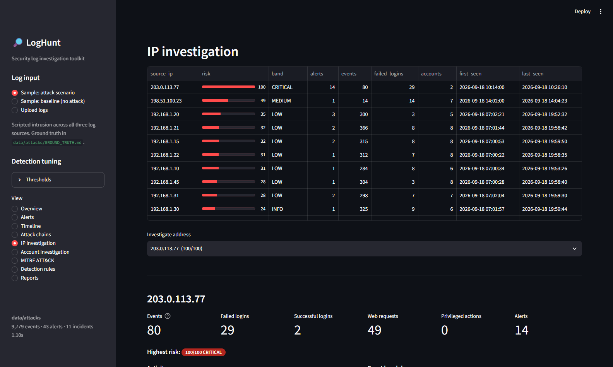
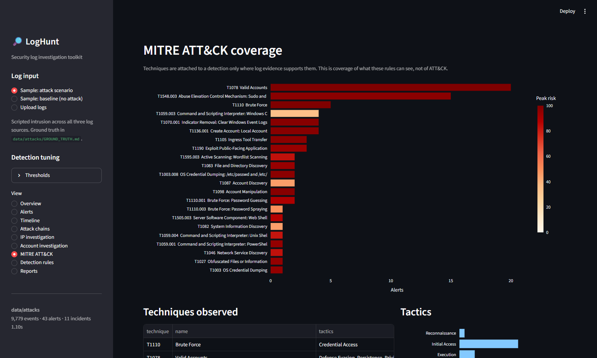

**LogHunt** takes a pile of log files and answers the question an analyst
actually has: *what happened, to whom, and what do I check next?*

It is not a SIEM, and I deliberately kept it from becoming one. It is the part
of the workflow between "here are 9,000 log lines" and "here is the incident
report".

```text
auth.log · security.log · access.log
             ↓
        Log parsers      format vote
             ↓
      Normalization      one schema
             ↓
   Detection engine      11 rules
             ↓
  Event correlation      → incidents
             ↓
       Risk scoring      0–100
             ↓
Investigation report
```

## The problem I was actually solving

Three things make log investigation painful, and none of them are fixed by
writing a parser:

1. **An alert with no context is unactionable.** "Brute force from
   203.0.113.77" is background radiation on anything facing the internet.
   "Brute force, then a *successful* login, then a privileged command, then an
   encoded PowerShell payload — same address, twenty minutes" is an incident.
2. **A severity label cannot rank a queue.** Twenty `HIGH` alerts still leave
   you picking one at random.
3. **The evidence is split across files that look nothing alike.** The attack
   crosses the web log, the auth log and the Windows event log. Joining them
   is manual work.

## How it works

Everything hangs off one decision: **normalize first**. Every parser — Linux
`auth.log` (syslog and RFC3339), Windows Security (Event Viewer text, CSV or
JSON) and Apache/Nginx access logs — emits the same 20-field event. After that,
one detection rule covers SSH and Windows event 4625 at the same time, without
knowing either format exists.

Format detection works by **parser vote**: every parser gets a sample of the
file and whichever recognises the most lines wins. Filenames lie; content
doesn't.

Eleven rules across six families: brute force, login-after-brute-force,
anomalous login source, privilege escalation, web attack, and suspicious
process execution. Three judgement calls did more for the output quality than
any extra rule:

- **The binary isn't the alert, the command line is.** `cmd.exe /c dir` is
  `low`. `powershell.exe -nop -w hidden -enc <base64>` is `critical`. A flat
  "these binaries are suspicious" list produces a queue nobody reads.
- **Web findings say *suspected*.** A signature match proves a payload was
  *sent*, never that it worked — so the HTTP status sits next to every
  finding. A 200 on an injection attempt is the thing that changes your day.
- **Routine `sudo` is `low` by default.** An admin using sudo is the most
  common line in an auth log. That rule exists to feed a chain, not to page
  anyone at 3am.



## The part I got wrong first

Correlation is the feature the whole project rests on, and my first version of
it was quietly broken.

I grouped alerts by any shared entity — source IP, account, **or host** —
within a time window. Host seemed obviously useful: a Windows process event
carries no client IP, so how else do you tie it back to the logon that spawned
it?

The result was one "incident" spanning **594 minutes and 33 alerts**, which had
swept up an admin's ordinary afternoon of `sudo` commands along with the actual
intrusion, because everything happened on the same two servers. Technically
correct grouping. Completely useless as an investigation.

Dropping host as a linking key gave me a clean **20-minute, 24-alert chain**
with the unrelated password-spray sitting in its own separate incident — and
the cross-log-source links still held, because the attacker's IP ties the web
exploitation to the SSH brute force, and the *account* ties the Windows process
events back to their logon.

The lesson I'll keep: a correlation rule that groups more is not a correlation
rule that works better.


## Risk scoring you can argue with

Every score is `base severity + frequency + context + correlation`, capped at
100 — and the breakdown is shown wherever the number is:

```text
 70  base severity (critical)
  8  event frequency (30 events)
  4  privileged account
  4  business-critical asset
  3  external source address
 10  part of a 7-stage attack chain
  4  chain spans multiple log sources
 -3  capped at the 100-point ceiling
---
100/100 CRITICAL
```

I found a genuine bug here by clicking through my own UI: the factors summed
higher than the capped total, so the "why this score" table silently disagreed
with the score above it. If you're going to show your working, the working has
to add up.

Correlation is a real feedback loop rather than decoration — alerts get scored,
grouped into incidents, then **re-scored** now that the chain is known. The same
17-failure brute force scores lower on its own than it does when followed by a
login and a privileged command. There's a test that asserts exactly that.

## Proving it works

This is the part I care about most. A detection tool that only ever runs on
data containing attacks is a tool nobody has measured.

So the generator writes **two** datasets from one seed: an intrusion woven
through a day of ordinary activity, and the *same* background activity with no
attack in it. Ground truth is written out beside the logs, so every alert can
be checked instead of admired.

| | attack dataset | clean baseline |
|---|---|---|
| Events | 9,779 | 9,669 |
| Alerts | 43 (16 critical, 5 high) | **18 — all low/info, zero medium+** |
| Attack-only rules that fired | 10 of 11 | **0 of 6** |
| Top incident | **100/100 CRITICAL** — 24 alerts, 7 stages, 20 min, all 3 log sources | 47/100 MEDIUM |

The second column is the one that matters. Detecting the attack is easy if you
don't care how much you shout on a quiet day, and the tests assert **both** —
detection on one dataset and silence on the other. Loosen a threshold and the
suite fails.

The scripted intrusion runs from reconnaissance through to cleanup: 41 path
probes, SQL injection and traversal attempts, 17 failed SSH passwords for
`admin`, the password landing one second after the last failure, `/etc/shadow`
read via sudo, a UID 0 account created, then a jump to the domain controller —
RDP logon, encoded PowerShell download cradle, `certutil` transfer, SAM hive
export — and finally a new account added to Administrators and the security
audit log cleared.

LogHunt reconstructs all eight stages as a single incident.



## MITRE ATT&CK, only where it's earned

22 techniques come out of the sample scenario. I only mapped a technique where
log evidence actually supports it — it's easy to inflate a coverage chart by
attaching techniques a rule can't really prove, and it makes investigations
worse while making the screenshot look better.



## What it can't do

Written down properly in the repo, because limitations you haven't stated read
like limitations you haven't found:

- Detection is threshold and signature based. **No ML.** A patient attacker who
  stays under the thresholds goes unnoticed.
- A signature match proves an *attempt*. Confirming the SQL injection worked
  needs the application and database logs.
- Correlation groups on IP and account. Change both between stages and the
  chain breaks; share a NAT address and unrelated activity merges.
- A `sudo` line in `auth.log` carries no client IP, so on the IP page an
  attacker shows 0 privileged actions even though the alerts for those actions
  are listed directly below it. Inferring the session IP is possible but
  guesses wrong when sessions overlap, so I left it out rather than fake the
  attribution.
- The sample data is synthetic. It measures the rules against a known scenario,
  not against real-world traffic.

Next on the list: `.evtx` and Sysmon parsing, Linux session reconstruction so
sudo inherits its session's source address, and Sigma rule import — the engine
already separates rule logic from the schema, so that one should slot in.

## Why this one, next to the FYP

My [Final Year Project](/projects/idps-web-servers/) is a context-aware IDPS —
it detects and prevents web attacks as they happen. LogHunt is the other half
of that story: investigating the evidence an attack leaves behind.

One stops the request. The other reconstructs what the request was part of. I
wanted both sides.

---

*Built in Python with pandas, Streamlit and Plotly. 80 tests, including
end-to-end tests against ground truth.*
